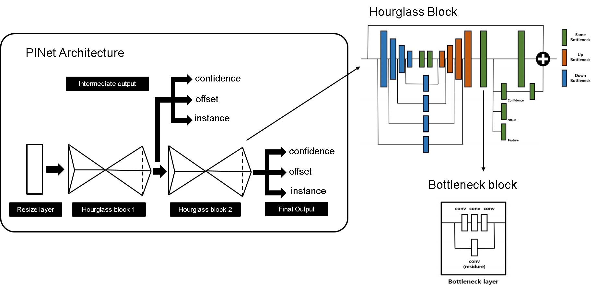
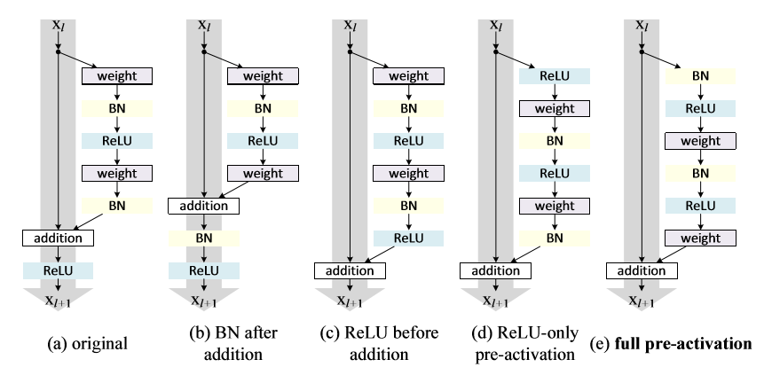
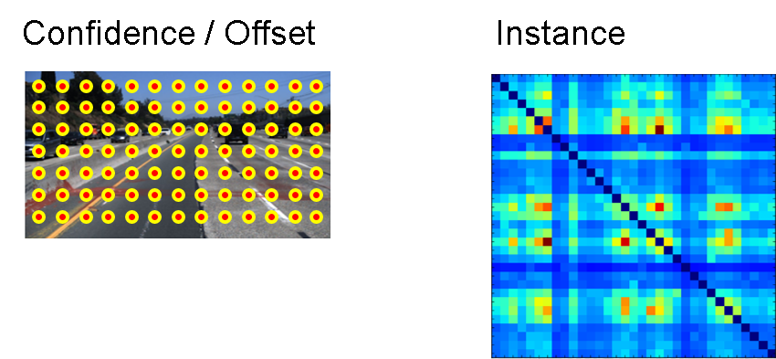
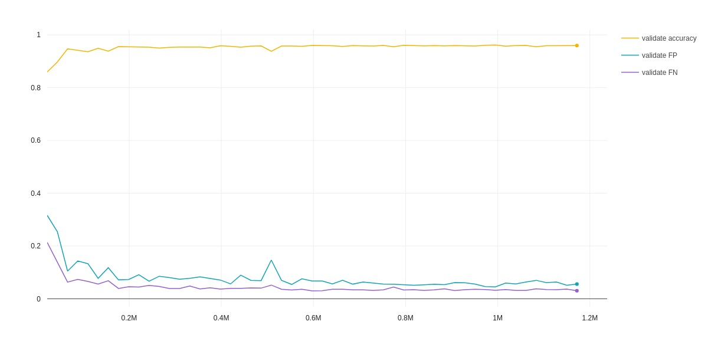

# 1. lane detector with front camera
[PINet](https://arxiv.org/pdf/2002.06604.pdf) based lane detector for various road types and lane directions, trained with tusimple, culane, and bdd100k. 

This repo is based on the paper [Key Points Estimation and Point Instance Segmentation Approach for Lane Detection](https://arxiv.org/abs/2002.06604), and the original implementation in [project PINet](https://github.com/koyeongmin/PINet).

My related works including
* retrained the network with tusimple, culane and BDD100K, significantly extended the performance for various road types and directions. original work uses only tusimple.
* rewrite projects
* some detailed discussion about the original implementation.
* make this model compatible for torch JIT compile
* use libtorch and container to deploy this model with 0.03-0.04 second per frame on laptop with NVidia GTX 1080

My results:
* from test car, [link](https://youtu.be/kfctellnZxw)
* culane [day](https://youtu.be/btAidqruAlw) and [night](https://youtu.be/HmPz5ugQD_I)

# 2. PINet
The key concept from original PINet paper is not doing pixel segmentation but key points detection with anchor based methods. This idea saved a lot of post-processing works compared with pixel based semantic segmentation, and more robust.


### 2.1 Architecture


* first pass the input image to a resize module
* then pass to two hourglasses one by one
* output of each hourglass will be used for loss calculation, such as intermediate supervision

### 2.2 Bottleneck block
Bottleneck block in PINet is a residual block.

There are many discussion about different residual block layout. Some typical layout has been analysed in this paper [Identity Mappings in Deep Residual Networks](https://arxiv.org/pdf/1603.05027v3.pdf).



* original Stacked Hourglass Networks used **(e) full pre-activation**
* PINet uses **(c) relu before addition**

* discussion in [Identity Mappings in Deep Residual Networks](https://arxiv.org/pdf/1603.05027v3.pdf)
  * for shallow network, the influence is not significant between **(c)** and **(e)**, otherwise recommend **(e)**
  * denote y1 = h(x1) + F(x1), x2 = f(y1) where h() is shortcut, F() is residual functions, f() is activation
  * recommendation 1: use h() as identity mapping, i.e. h(x1)=x1
  * problem of **(c)**, ReLU as last step in residual is always positive and x2= x1 + F(x1), thus x2 is always increasing.
 * **(b)** is a post normalization pattern, which has been used and discussion in transformer architecture. 
  * Transformers without Tears:Improving the Normalization of Self-Attention, [link](https://tnq177.github.io/data/transformers_without_tears.pdf)

### 2.3 Loss function
PINet has 3 branches output. The confidence and offset is similar to other anchor based detection algorithm. The instance branch mapping keypoints from different lanes into a high dimensional feature space. The output looks like a similarity matrix. 



Note, in PINet, the network only learned how to use different feature vectors to distinguish keypoints from different lanes. So we need an extra clustering step to determine the real groups(lanes) for the keypoints based on these feature vectors. From the original paper, the author used mean-shift clustering for this step. The inference is really fast due to small network size, but the current clustering outside network can time consuming, which can be probabliy imporved later.

### 2.4 Training

I extended the training to tusimple, culane and BDD100k. I did not dive deep into tuning, data augmentation and so on for now. Maybe next kaggle event, if anyone want to team up.

below is an examplar validation log with tusimple rules.


# 3. Usage
* test on culane, result video for [day](https://youtu.be/btAidqruAlw) and [night](https://youtu.be/HmPz5ugQD_I)
```
python -m scripts.predict_pinet on_folder --path="{culane_root}/driver_182_30frame/05312333_0003.MP4" --save=True
```
* test on tusimple, [result video for testset](https://youtu.be/mHYNO2uu8Dg)
```
python -m scripts.predict_pinet on_folder --path="{tusimple_root}/lane_detection/test_set/clips/0530" --save=True --recursive=True
```

# Repository Author
* Zhiliang Zhou, [Linkedin](https://www.linkedin.com/in/zhiliang-zhou/)

# License
The project is derived from [PINet](https://github.com/koyeongmin/PINet)

The [PINet](https://github.com/koyeongmin/PINet) code is licensed under MIT license.
