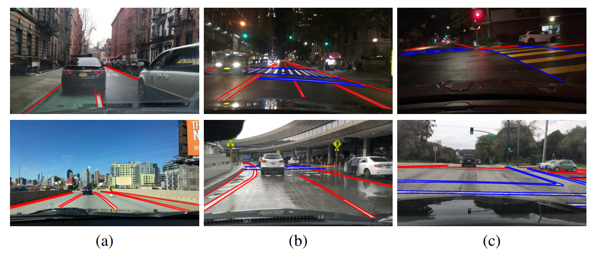
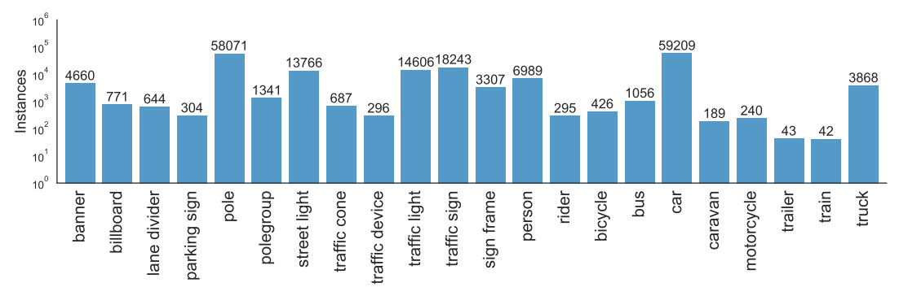

# BDD100K
# 1. Information
*  [white paper](https://arxiv.org/pdf/1805.04687.pdf)
*  general data distribution


* object detection - 10 classes with bounding box

  * bus
  * traffic light
  * traffic sign
  * car
  * person
  * bike
  * truck
  * motor
  * train
  * rider
* Lane marking detection
  * attributes
    * laneType
      * road curb            157401 in pixel?  Bordstein auf deutsch
      * double white         8222
      * double yellow        53426
      * double other         37
      * single white         353288
      * single yellow        28993
      * single other         394
      * crosswalk            154108
  * laneDirection
    * parallel             562157
    * vertical             193712
  * LaneType
    * solid                 755869
    * dashed               91626



* drivable area
  * drivable (red)
  * alternative (blue)


* fine semantic segmentation
  * 40 classes or 22 classes ?
  * 3683 training
  * 500 validation
  * 1500 testing


# 2. Parser Guide

```python
f = open("bdd100k_labels_images_val.json", "r")
data = json.load_points(f) # list of all records, 10000 for val

sample = data[0]  # dict
# sample.keys()
# dict_keys(['timestamp', 'attributes', 'name', 'labels'])
# sample['timestamp'],  type=int
# sample['attributes'], type=dict, value={'scene': 'city street', 'timeofday': 'daytime', 'weather': 'overcast'}
# sample['name'],       type=str, value='b1c66a42-6f7d68ca.jpg'
# sample['labels'],     type=list

label = sample['labels'][0]  # type=dict
# catagory: traffic sign, traffic light, car, rider, motor....
# dict_keys(['box2d', 'attributes', 'manualShape', 'id', 'manualAttributes', 'category'])

# catagory: drivable area, lane
# dict_keys(['attributes', 'manualShape', 'poly2d', 'manualAttributes', 'category', 'id'])
```

# 3. folder

```
bdd100k
    |-------drivable_maps
        |------- color_labels
            |------- train (70000 files)
            |------- val (10000 files)
        |------- labels
            |------- train (70000 files)
            |------- val (10000 files)
    |-------images
        |------- 100k
            |------- test (20000 files)
            |------- train (70000 files)
            |------- val (10000 files)
        |------- 10k
            |------- test (2000 files)
            |------- train (7000 files)
            |------- val (1000 files)
    |-------labels
    |-------seg
        |------- color_labels
            |------- train (7000 files)
            |------- val (1000 files)
        |-------images
            |------- test (2000 files)
            |------- train (7000 files)
            |------- val (1000 files)
        |------- labels
            |------- train (7000 files)
            |------- val (1000 files)
```

```bash
$ find . -name "0a0a0b1a-7c39d841*"          
./seg/color_labels/train/0a0a0b1a-7c39d841_train_color.png
./seg/labels/train/0a0a0b1a-7c39d841_train_id.png
./seg/images/train/0a0a0b1a-7c39d841.jpg
./drivable_maps/color_labels/train/0a0a0b1a-7c39d841_drivable_color.png
./drivable_maps/labels/train/0a0a0b1a-7c39d841_drivable_id.png
./images/10k/train/0a0a0b1a-7c39d841.jpg
./images/100k/train/0a0a0b1a-7c39d841.jpg

```

# 4. Semantic Segmentation
* [source](https://github.com/ucbdrive/bdd-data/blob/master/bdd_data/label.py)

```python
# Our extended list of label types. Our train id is compatible with Cityscapes
labels = [
    #      name                id  trainId   color
    Label('unlabeled'         ,  0 , 255 ,  (  0,  0,  0)),
    Label('dynamic'           ,  1 , 255 ,  (111, 74,  0)),
    Label('ego vehicle'       ,  2 , 255 ,  (  0,  0,  0)),
    Label('ground'            ,  3 , 255 ,  ( 81,  0, 81)),
    Label('static'            ,  4 , 255 ,  (  0,  0,  0)),
    Label('parking'           ,  5 , 255 ,  (250,170,160)),
    Label('rail track'        ,  6 , 255 ,  (230,150,140)),
    Label('road'              ,  7 ,   0 ,  (128, 64,128)),
    Label('sidewalk'          ,  8 ,   1 ,  (244, 35,232)),
    Label('bridge'            ,  9 , 255 ,  (150,100,100)),
    Label('building'          , 10 ,   2 ,  ( 70, 70, 70)),
    Label('fence'             , 11 ,   4 ,  (190,153,153)),
    Label('garage'            , 12 , 255 ,  (180,100,180)),
    Label('guard rail'        , 13 , 255 ,  (180,165,180)),
    Label('tunnel'            , 14 , 255 ,  (150,120, 90)),
    Label('wall'              , 15 ,   3 ,  (102,102,156)),
    Label('banner'            , 16 , 255 ,  (250,170,100)),
    Label('billboard'         , 17 , 255 ,  (220,220,250)),
    Label('lane divider'      , 18 , 255 ,  (255, 165, 0)),
    Label('parking sign'      , 19 , 255 ,  (220, 20, 60)),
    Label('pole'              , 20 ,   5 ,  (153,153,153)),
    Label('polegroup'         , 21 , 255 ,  (153,153,153)),
    Label('street light'      , 22 , 255 ,  (220,220,100)),
    Label('traffic cone'      , 23 , 255 ,  (255, 70,  0)),
    Label('traffic device'    , 24 , 255 ,  (220,220,220)),
    Label('traffic light'     , 25 ,   6 ,  (250,170, 30)),
    Label('traffic sign'      , 26 ,   7 ,  (220,220,  0)),
    Label('traffic sign frame', 27 , 255 ,  (250,170,250)),
    Label('terrain'           , 28 ,   9 ,  (152,251,152)),
    Label('vegetation'        , 29 ,   8 ,  (107,142, 35)),
    Label('sky'               , 30 ,  10 ,  ( 70,130,180)),
    Label('person'            , 31 ,  11 ,  (220, 20, 60)),
    Label('rider'             , 32 ,  12 ,  (255,  0,  0)),
    Label('bicycle'           , 33 ,  18 ,  (119, 11, 32)),
    Label('bus'               , 34 ,  15 ,  (  0, 60,100)),
    Label('car'               , 35 ,  13 ,  (  0,  0,142)),
    Label('caravan'           , 36 , 255 ,  (  0,  0, 90)),
    Label('motorcycle'        , 37 ,  17 ,  (  0,  0,230)),
    Label('trailer'           , 38 , 255 ,  (  0,  0,110)),
    Label('train'             , 39 ,  16 ,  (  0, 80,100)),
    Label('truck'             , 40 ,  14 ,  (  0,  0, 70)),
]
```

# 5. example label dict
* Image: 0000f77c-6257be58.jpg
```
[
    {
        'category': 'traffic light', 
        'attributes': {'occluded': False, 'truncated': False, 'trafficLightColor': 'green'}, 
        'manualShape': True, 
        'manualAttributes': True, 
        'box2d': {'x1': 1125.902264, 'y1': 133.184488, 'x2': 1156.978645, 'y2': 210.875445},
        'id': 0
    }, 
     
    {
        'category': 'traffic light', 
        'attributes': {'occluded': False, 'truncated': False, 'trafficLightColor': 'green'}, 
        'manualShape': True, 
        'manualAttributes': True, 
        'box2d': {'x1': 1156.978645, 'y1': 136.637417, 'x2': 1191.50796, 'y2': 210.875443}, 
        'id': 1
    }, 
    
    {
        'category': 'traffic sign', 
        'attributes': {'occluded': False, 'truncated': False, 'trafficLightColor': 'none'}, 
        'manualShape': True, 
        'manualAttributes': True, 
        'box2d': {'x1': 1101.731743, 'y1': 211.122087, 'x2': 1170.79037, 'y2': 233.566141}, 
        'id': 2
    }, 
    
    {
        'category': 'traffic sign', 
        'attributes': {'occluded': False, 'truncated': True, 'trafficLightColor': 'none'}, 
        'manualShape': True, 
        'manualAttributes': True, 
        'box2d': {'x1': 0, 'y1': 0.246631, 'x2': 100.381647, 'y2': 122.825696}, 
        'id': 3
    }, 
    
    {
        'category': 'car', 
        'attributes': {'occluded': False, 'truncated': False, 'trafficLightColor': 'none'}, 
        'manualShape': True, 
        'manualAttributes': True, 
        'box2d': {'x1': 45.240919, 'y1': 254.530367, 'x2': 357.805838, 'y2': 487.906215}, 
        'id': 4
    }, 
    
    {
        'category': 'car', 
        'attributes': {'occluded': False, 'truncated': False, 'trafficLightColor': 'none'}, 
        'manualShape': True, 
        'manualAttributes': True, 
        'box2d': {'x1': 507.82755, 'y1': 221.727518, 'x2': 908.367588, 'y2': 442.715126}, 
        'id': 5
    }, 
    
    {
        'category': 'traffic sign', 
        'attributes': {'occluded': False, 'truncated': True, 'trafficLightColor': 'none'}, 
        'manualShape': True, 
        'manualAttributes': True, 
        'box2d': {'x1': 0.156955, 'y1': 0.809282, 'x2': 102.417429, 'y2': 133.411856}, 
        'id': 6
    }, 
    
    {
        'category': 'drivable area', 
        'attributes': {'areaType': 'direct'}, 
        'manualShape': True, 
        'manualAttributes': True, 
        'poly2d': [
                    {'vertices': [[1280.195648, 626.372529], 
                                  [1280.195648, 371.830705], 
                                  [927.081254, 366.839689], 
                                  [872.180076, 427.979637], 
                                  [658.814135, 450.439209], 
                                  [585.196646, 426.731883], 
                                  [0, 517.817928], 
                                  [0, 602.665203], 
                                  [497.853863, 540.2775], 
                                  [927.081254, 571.471352], 
                                  [1280.195648, 626.372529]], 
                    'types': 'LLLLLLLLCCC', 
                    'closed': True
                    }
                  ], 
        'id': 7
    }, 
    
    {
        'category': 'lane', 
        'attributes': {'laneDirection': 'parallel', 'laneStyle': 'solid', 'laneType': 'road curb'}, 
        'manualShape': True, 
        'manualAttributes': True, 
        'poly2d': [
                    {'vertices': [[503.674413, 373.137193], 
                                [357.797732, 374.672737]], 
                    'types': 'LL', 
                    'closed': False
                    }
                  ], 
        'id': 8
    }, 
        
    {
        'category': 'lane', 
        'attributes': {'laneDirection': 'parallel', 'laneStyle': 'solid', 'laneType': 'road curb'}, 
        'manualShape': True, 
        'manualAttributes': True, 
        'poly2d': [
                    {'vertices': [[62.973282, 371.601649], 
                                  [0, 368.53056]], 
                     'types': 'LL', 
                     'closed': False
                    }
                   ], 
        'id': 9
    }, 
    
    {
        'category': 'lane', 
        'attributes': {'laneDirection': 'parallel', 'laneStyle': 'solid', 'laneType': 'road curb'}, 
        'manualShape': True, 
        'manualAttributes': True, 
        'poly2d': [
                    {'vertices': [[1274.517503, 376.208281], 
                                  [905.986941, 371.601649]],
                     'types': 'LL', 
                     'closed': False
                     }
                   ], 
        'id': 10
    }
]
```