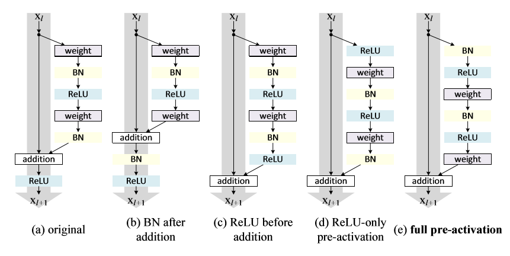

# different order for residual block
* residual block 结构讨论 Identity Mappings in Deep Residual Networks, Kaiming He, [link](https://arxiv.org/pdf/1603.05027v3.pdf)

* original Stacked Hourglass Networks 用的是 **(e) full pre-activation**
* original PINet uses **(c) relu before addition**